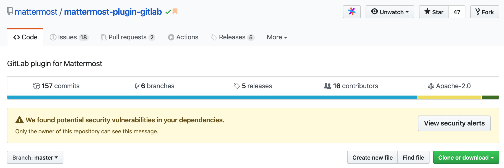
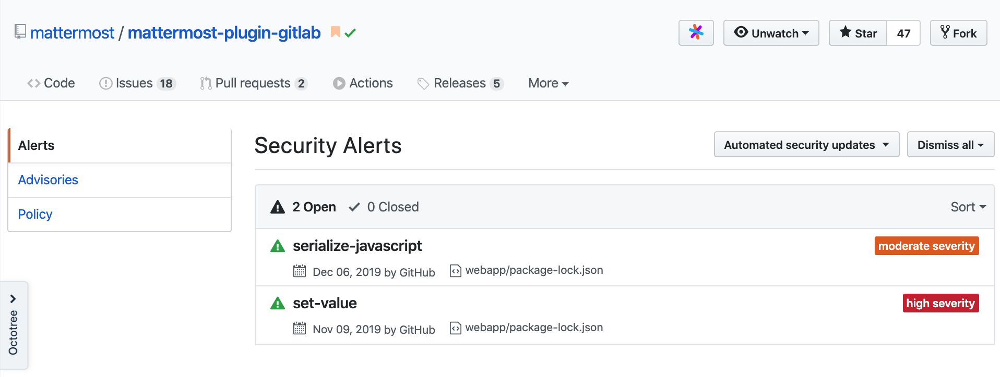
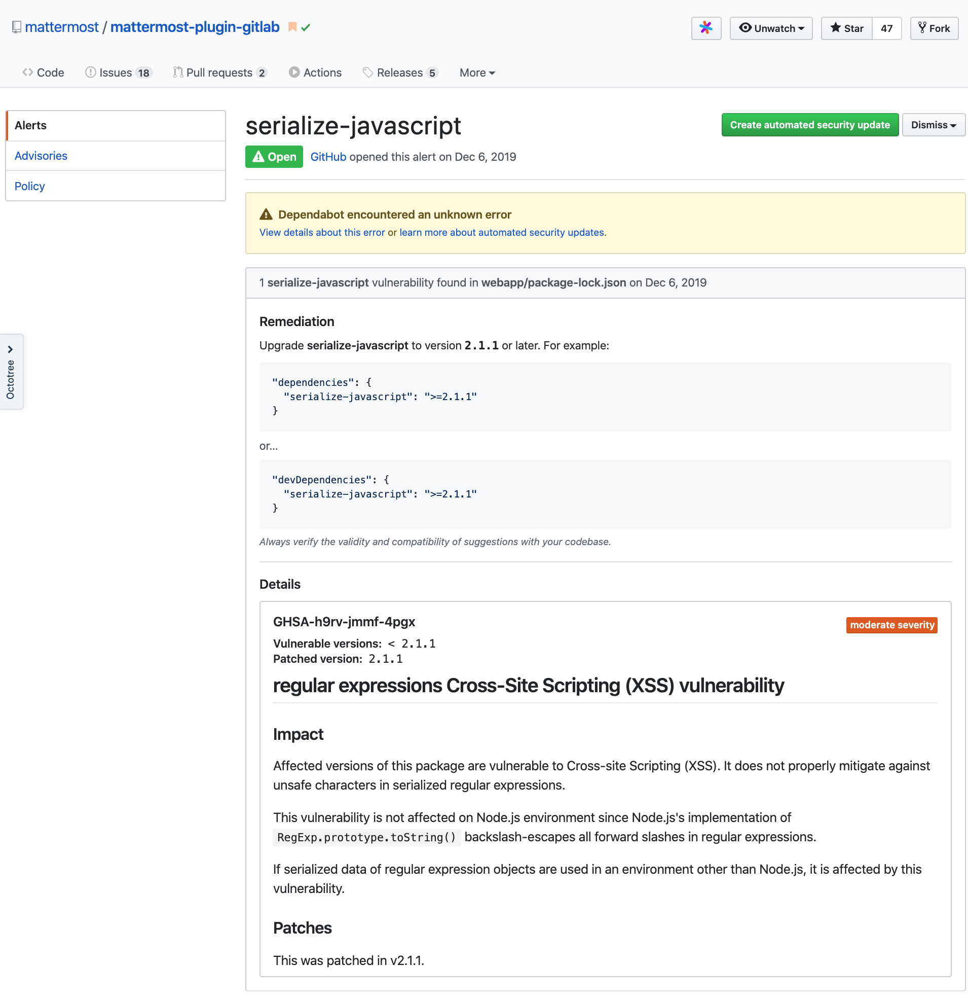
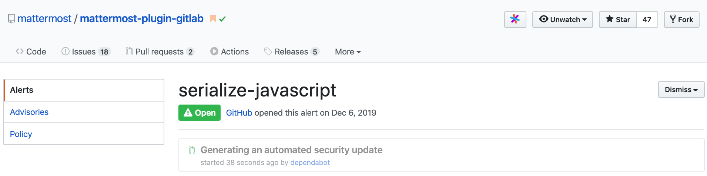

# Plugin Release Process

[GitBook Entry](https://app.gitbook.com/@jason-frerich/s/plugin-release-process)  
[GitHub Page](https://github.com/jfrerich/plugin-release-process)

<!-- vim-markdown-toc GFM -->

* [OVERVIEW](#overview)
* [GOALS](#goals)
* [SCOPE](#scope)
* [PLUGIN RELEASE FLOWS](#plugin-release-flows)
  * [Considerations when bumping and releasing a plugin version](#considerations-when-bumping-and-releasing-a-plugin-version)
  * [Bump current version of an existing plugin](#bump-current-version-of-an-existing-plugin)
  * [Tag/cut a version of a plugin for release](#tagcut-a-version-of-a-plugin-for-release)
  * [Bundle a plugin release version to a Mattermost server release](#bundle-a-plugin-release-version-to-a-mattermost-server-release)
  * [Publish a plugin release version to the Plugin Marketplace](#publish-a-plugin-release-version-to-the-plugin-marketplace)
  * [Plugin Intake](#plugin-intake)
    * [Create PR for Initial Review](#create-pr-for-initial-review)
    * [Plugin Review Checklist](#plugin-review-checklist)
  * [Publish a new plugin to the Plugin Marketplace](#publish-a-new-plugin-to-the-plugin-marketplace)
* [FUTURE ENHANCEMENTS](#future-enhancements)
* [SECURITY RELEASE / UPGRADE PROCESS](#security-release--upgrade-process)
  * [Updating Security Alerts Through CLI](#updating-security-alerts-through-cli)
  * [Updating Security Alerts Through GitHub](#updating-security-alerts-through-github)

<!-- vim-markdown-toc -->

## OVERVIEW

The release process for modifying plugin versions and plugin version dependencies currently requires a developer to perform several non-automated tasks. Bumping, tagging, releasing, publishing, and bundling \(preloading\) versions are not necessarily complicated, but a formal set of steps is required and should be followed. This document describes those processes in detail and will be used to help standardize and automate these flows in the future.

## GOALS

1. Define the steps required to bump, tag, release, publish, and bundle plugin versions.
2. Through defining specific tasks during the process we will be able to define protocols and identify areas for automation improvements.

## SCOPE

This document covers the current steps required to perform the following tasks

1. Bump the current version of an existing plugin
2. Tag a version of a plugin for release
3. Bundle a plugin version to a Mattermost server release
4. Publish a bumped plugin version to the Plugin Marketplace
5. Publish a new plugin to the Plugin Marketplace
   1. Release to community.mattermost.com

The Future Enhancements section of this document describes additional suggestions for automating some of these tasks.

## PLUGIN RELEASE FLOWS

### Considerations when bumping and releasing a plugin version

\(**`TODO:`** Need permanent place to place the spreadsheet\)

* Compare commits from last bump / tagged release
* Documentation \(README.md\) changes aren’t necessarily vital
  * Documentation through bundled releases aren’t viewable through the app and users will be looking at the latest master commit in the github repo
* Keep spreadsheet up to date
* The PR for the version bump \(in the plugin repo\) does not mean that is the last commit to get tagged. This step only bumps the version. The tagging step actually determines the commit that is tagged with the release tag

### Bump current version of an existing plugin

\(**`TODO:`** First determine the next version number. Currently using spreadsheet\)  
\(**`TODO:`** Determine naming convention for branch name\)  
\(**`TODO:`** After Automation of this process, reviewers \(QA and PM\) can possibly be removed\)  
\(**`TODO:`** during automation, need to verify make targets to propagate manifest info to server/webapp dirs\)  
\(**`TODO:`** gitlab uses `make apply`\)  
\(**`TODO:`** automate Security checks before bumping version\)  
\(**`TODO:`** must have admin access\)

Changing the version of a plugin is no different than any other PR and requires 2 Developers and 1 QA Reviewer. Also add a PM review to verify the plugin change.

**Create a commit with new version**

* verify No existing Security issues \(must have admin access\)
  * will show as message below commits, branches, releases banner and above branch pulldown menu
* `git pull` on the master branch in your local plugin repository to prepare for creating a branch
* `git checkout -b bump-version-vX.X.X` to create a branch to perform the necessary edits
* Edit `plugin.json` and bump the plugin’s `version` field in the json object. This file is located in the root directory of the plugin
* Run `make` to build the plugin and update the plugin manifest files. The manifest files exist for server and webapp plugin directories. Possible manifest files are `server/manifest.go`, `webapp/src/manifest.ts` and `webapp/src/manifest.js`
  * `make apply` is available sometime and will propogate manifest info to server/ and webapp/
* `git status` verify no untracked files will get added with following git -A 
* `git add -A` if the make target builds successfully to add the files for commiting
* `git commit -m “Bump version to 1.1.2”` to commit the new commit
* `git push --set-upstream origin bump-version-1.1.2` to push the commit to origin and prepare the PR

**Create a PR against the master branch of the plugin repository**

* **PR Title**: `Bump version to X.X.X`
* **PR Summary**: `Bump version to X.X.X` \(use the same text for the PR summary\)
  * Add any further reasoning or description for version bump \(if necessary\)
* Add 2 Developers, 1 PM, and 1 QA for review
* Add `Dev Review`, `QA Review`, and `PM Review` labels

### Tag/cut a version of a plugin for release

\(**`TODO:`** Create Documentation for adding release notes to the new release\)  
\(**`TODO:`** Create Documentation for adding release notes to the new release\)

Tagging a plugin version for release prepares the version as a dependency for inclusion in other repos. This includes adding a tagged version into the Plugin Marketplace as well as bundling with a specific version of the Mattermost Server repo.

After the PR for bumping the version of a plugin has been merged, you can now tag the version for release.

* `git checkout master` 
* `git pull` Sync latest commit to your local dev machine
  * Double check the last commit on master is the version bump commit
* `git tag -a vX.x.x -m vX.x.x`
  * Tag the branch and use the tag version as the message for the tag commit
* `git push origin vX.x.x`
  * Push the new tag to the plugin repo
  * origin is the alias defined locally for the remote repository
* The new tag will be created and CI will run the build scripts
  * CI runs can be viewed at [circleci.com/gh/mattermost](https://circleci.com/gh/mattermost)
* If CI jobs complete successfully, a new release will automatically be produced and viewable under the `Releases` tab in the plugin repo
* Add Release notes to the release

### Bundle a plugin release version to a Mattermost server release

\(**`TODO:`** Branch name - determine naming convention for PR branch name\)  
\(**`TODO:`** PR - determine naming convention for PR Title\)  
\(**`TODO:`** PR - determine naming convention for PR Summary\)  
\(**`TODO:`** PR - inside summary get list of from -&gt; to versions with automation\)

Plugins that are released with Mattermost are called bundled plugins. These plugins are included with the software and need only to be configured.

* `git pull` the latest master branch on mattermost-server
* Create a new branch so you can modify the plugin versions
  * `git checkout -b bundle-plugins-v5.20`
  * Use branch naming convention `bundle-plugins-vX.XX`
* Edit Makefile
  * Locate `# Plugins Packages` comment
  * Modify plugin release versions
* Create PR against master branch with following:
  * **Title:** Update bundled plugins for vX.XX
  * **Summary:** List of updated plugins
    * Ideally includes from version -&gt; to version for each plugin

### Publish a plugin release version to the Plugin Marketplace

\(**`TODO`**: Determine content for tickets to toolkit\)  
\(**`Automation`**: Autocreate the Jira ticket after merging on GH. Fill out all fields\)

Currently, the toolkit team is responsible for publishing a plugin to the plugin marketplace. After cutting a version for release follow these steps to have the version tagged for publishing.

Until automation is complete, clone the following ticket and adjust plugin details.

* Use this Clone → [mattermost.atlassian.net/browse/MM-21665](https://mattermost.atlassian.net/browse/MM-21665)  \(Jira\)
* Another example → [mattermost.atlassian.net/browse/MM-21122](https://mattermost.atlassian.net/browse/MM-21122)  \(Zoom\)

**Create Jira Ticket**

* **Title**: Add plugin Jira v2.3.2 to the marketplace
* **Description**: [github.com/mattermost/mattermost-plugin-jira/releases/tag/v2.3.2](https://github.com/mattermost/mattermost-plugin-jira/releases/tag/v2.3.2)
  * Link to tagged release
* **QA Test Steps**:
  * Verify that jira v2.3.2 can be:
    * updated
    * installed
    * enabled
    * disabled
* **Mana:** 2
* **FIX VERSIONS:** triage
* **MATTERMOST TEAM:** Toolkit
* **QA TESTING AREAS:** Plugins MarketPlace

Example Tickets for publishing.

* [mattermost.atlassian.net/browse/MM-21665](https://mattermost.atlassian.net/browse/MM-21665)

### Plugin Intake

####  Create PR for Initial Review

\(**`TODO`**: See if `hub` CLI can automate PR creation\)  
\(**`TODO`**: need to instruct new plugins to initialize a commit that can be easily compared for PR.  options are starter-plugin commit or empty branch. Git compare dirs to see if first commit was starter plugin or included changes from author\)  
\(**`TODO`**: Review anti-pattern link [Do Not Issue Pull Requests From Your Master Branch - Learn, Converse, Share](https://blog.jasonmeridth.com/posts/do-not-issue-pull-requests-from-your-master-branch/)  
\(**`TODO`**: Cannot assign reviewers easily in forked branch in my personal repo.  Try forking to mattermost   
\(**`TODO`**: Don’t have forking permissions to Mattermost Organization.

This is a brief overview of the steps required to create the initial PR for Plugin Intake Review.  

* **Fork the repo so no possibility to mess up authors repo**
  * use GitHub \(possibly hub cli\)
* **Insert empty root commit into master \(probably over kill\)** 
  * most plugins will start from starter-template
    * skip this section if using first commit from authors master branch
  * `git checkout --orphan emptyroot`
  * `git rm -rf .`
  * `git commit —allow-empty -m ‘empty root commit for PR’`
  * `git rebase —onto emptyroot —root master`
  * `git branch -d emptyroot`
* **Create initial-commit-branch-for-PR**
  * `git checkout <commit-hash>`
    * choose commit to compare against latest master
    * could use empty root commit \(overkill\) or initial commit in repo \(likely from plugin-starter template\)
  * `git checkout -b initial-commit-branch-for-PR`
    * create as new branch
  * `git push --set-upstream origin initial-commit-branch-for-PR`
    * push to remote 
* **Create master branch copy**
  * `git checkout master`
  * `git checkout -b master-dev-copy`
  * `git push --set-upstream origin master-dev-copy`
* **GH create PR**
  * base: `initial-commit-branch-for-PR`
  * compare: `master-dev-copy`

#### Plugin Review Checklist
\(**`TODO`**: when automate, add checklist into description section\)  

* README.md 
  * Installation instructions provided, detailed, and accurate
  * Use cases are defined and documented
* Installation
  * `make` executes without errors
  * no lint errors
* Security
  * `npm audit` returns with no issues
* Best Practices
  * recognize anti-patterns
  * variable / function naming \(possibly automate check with go or write AST script\)
    * vars: fooBar
    * Public Methods: FooBar\(\)
    * Private Methods: fooBar\(\)
  * idiotmatic Go
    * err handling

### Publish a new plugin to the Plugin Marketplace

## FUTURE ENHANCEMENTS

This section lists possible enhancements to the release flow. By gathering the details of the flow and breaking into specific tech areas, we can start create a design spec and start building automation for the entire plugin release flow.

1. Bumping Plugin Version
2. Tagging version for release
3. Bundling plugins with mattermost
4. Publishing plugins to Marketplace
5. Filing Jira tickets to toolkit for publishing to marketplace
6. MM command to show bundled releases of current MM-server version
   1. Compare with latest tagged release of repos
   2. Include commit PR history for viewing changes since last tagged release

## SECURITY RELEASE / UPGRADE PROCESS

\(**`TODO`**: Automate checking all released plugins through CLI, cron, or GH webhook event\)  
\(**`TODO`**: User must be repo admin to see and resolve automated security issue\)  
\(**`TODO`**: Need method to hook to tell us when security issue is found\)  
\(**`TODO`**: PR for security updates should be discrete\)  
\(**`TODO`**: investigate `npm ls hoek`\)

Security alerts are displayed when viewing a GitHub repo and are resolved via the automated `dependabot` tool

### Updating Security Alerts Through CLI

* `git checkout latest master`
* `git checkout -b bump-dependency-versions`
* `cd webapp/`
* `npm audit` - will return list of security issues
* `npm audit fix` - updates package-lock.json dependencies
* `git add package-lock.json`
* `git commit -m "updated dependencies"`
* `git push --set-upstream origin bump-dependency-versions`

### Updating Security Alerts Through GitHub

Github displays security alerts when viewing a GitHub repo.

View all alerts by clicking on the `View security alerts` button.

Clicking on a specific security alert will open the details alert and provide a `Create automated security update` button. Clicking on the button have `dependabot` begin generating an automated security update.

